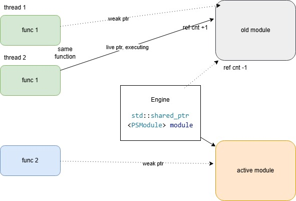

# Firebird: building hot-pluggable external user functions

### Abstract

A new External Engine for Firebird RDBMS enables the integration of custom functions into any database. A primary advantage of this engine is the support for live updates to function logic, eliminating the need for server downtime. This paper provides a design and implementation walk-through; the complete solution and test facilities are available in this [GitHub repository](https://github.com/mxck438/ps_engine).

### Intro

The ability to add user-developed functions, deployed as native OS modules, is an invaluable resource for any RDBMS. It allows for the implementation of algorithms of unbounded complexity—potentially employing powerful third-party libraries—and opens the door for integration with various external services.

Since Firebird 3.0, UDR (User Defined Routines) has been the widely accepted infrastructure for adding user-written functions to Firebird installations. A quick refresher on UDR follows.

### UDR

UDR allows a developer to build a custom module implementing any number of functions. This module is then deployed to Firebird server *plugins/udr* directory. An implemented function is made available to database clients after executing a special SQL statement. Let’s say we have built a module named ‘umod1’ implementing a function ‘my_sum_args’. The publishing statement is then:
```
create or alter function sum_args (
	n1 integer,
	n2 integer,
	n3 integer
)
returns integer
external name ‘umod1!my_sum_args’
engine udr;
```
This updates a database metadata adding new external function named ‘sum_args’ taking three integers and returning an integer. This also tells a Firebird core that an implementation of the function is accessed through External Engine named ‘udr’ by the name ‘umod1!my_sum_args’. 

The database users may now use the new function in their SQL queries:
```    
select sum_args(1, 5, 100) from rdb$database;
```
The UDR functionality is implemented in UDR Engine module – *libudr_engine.so*. It is a part of a standard Firebird distribution and is installed automatically into Firebird plugins directory. The UDR Engine implements a higher level Firebird Core concept – it is a Firebird plugin of a special type External Engine. The UDR Engine then delegates a function implementation to user-installed modules. In the above example, the function name ‘umod1!my_sum_args’ is interpreted by the UDR Engine in this way: load a user module ‘libumod1.so’ and lookup a function named ‘my_sum_args’ in it. 

<figure>
  
  <figcaption><i>Figure 1. The UDR system</i></figcaption>
</figure>

Thanks to Firebird Object Oriented API, user modules may be written in a number of supported languages, and potentially in any language supporting raw function pointers.

What is more interesting in a context of this study is the fact that instead of using a stock UDR Engine one can build a custom module with a similar functionality. This module is built separately of the main Firebird codebase, so that there is no need to recompile Firebird. So we will build our own implementation of a Firebird External Engine Plugin to achieve our goal.

### The Problem

Things become complicated when it comes to updating a production server. Hot-reloading is a practical necessity for environments that require 24/7 uptime. It lets you deploy bug fixes or update business logic in external functions without kicking users off the system or restarting the service. By eliminating maintenance windows, you can roll out improvements instantly without disrupting active transactions or long-running tasks. This also speeds up development, as you can test code changes in real-time without the overhead of a full server reboot.

### PSE

Let **‘PS Engine’ (PSE)** be the name of a new system. The name ‘PS’ does not really mean anything, just the two letters. 

PSE consists of a PS Engine module (*libps_engine.so*) – a Firebird External Engine plugin, and a user-developed module ‘ps module’ (*libps_module.so*). For simplicity PSE supports only one user module, and the name *libps_module.so* is hardcoded. However, PSE allows for reloading a new version of this module at any time upon request, without needing to restart the Firebird server. The switch to new version happens transparently to any number of existing connections. User functions executing at the time of version switch continue their execution with the old version of a user module. All new function invocations do bind to new version. PSE unloads the old module version when the last function entered this version returns. Read on for a detailed discussion of the implementation.

<figure>
  
  <figcaption><i>Figure 2. The PSE system.</i></figcaption>
</figure>

We install a PSE user function into the database with this statement:
```
create or alter function sum_args (
	n1 integer,
	n2 integer,
	n3 integer
)
returns integer
external name ‘my_sum_args’
engine pse;
```
Note that the engine name is ‘pse’, and the function external name is just ‘my_sum_args’, and there is no mention of a user module name.

We use the installed function just like before:
```
select sum_args(1, 5, 100) from rdb$database;
```
PSE has two built-in special functions to manage user module version. These functions should be installed into any database the server has access to.
```
create function pse_reload_module (
    dummy integer
) returns varchar(1024)
    external name 'pse_reload_module'
    engine pse;

create function pse_get_module_info (
    dummy integer
) returns varchar(1024)
    external name 'pse_get_module_info'
    engine pse;  
```
‘pse_reload_module’ initiates, well… module reload. It is not forbidden to reload a module as many times as is desired. Both functions return some module statistics (its version, file time, loaded time). ‘pse_get_module_info’ does just that – returns statistics. The ‘dummy’ parameter is reserved, it has no meaning for now.

We are now approaching the implementation details and will discuss next the Firebird External Engine internals.

### External Engine Plugin

Again, an External Engine Plugin is a standalone module, developed separately from the main Firebird codebase. The Firebird Core interacts with a plugin via specifically designed interfaces. This way a plugin has no linker bindings to Firebird binaries, and may be developed with any language supporting function pointers. We will go the C++ way though.

The interaction scenario may be decomposed into three distinct stages. 

When the Firebird Core first encounters a need to interact with an external engine (named ‘pse’ in our case), The Core lookups plugins.conf to find and load a corresponding library – libps_engine.so. It then calls a special exported entry function (actually named ‘firebird_plugin’), passing in a pointer to a Core’s IMaster interface. The library creates a so-called plugin factory and registers it through the IMaster as the IPluginFactory. The above sequence is executed only once, so the plugin factory is a singleton, and its lifetime spans until the server shutdown. The only duty of a plugin factory is to create new instances of External Plugins as IExternalEngine interfaces.
	
Whenever there is a first connection to any database, the Core uses registered plugin factory to create a new instance of a plugin. In theory there are as many Plugin instances as there are databases with connected users. When the last connection to a database closes, the Core calls release() for IExternalEngine object.

When a database connection issues a first call to an external function, the Core requests an IExternalEngine to create an instance of IExternalFunction interface. It then uses this interface to make an actual call to external function. The lifetime of IExternalFunction is till the end of connection, then IExternalFunction.dispose() is called. In theory (will be discussed later) there are as many IExternalFunction instances as the number of existing database/connection/function_name combinations.

<figure>
  
  <figcaption><i>Figure 3. External Engine procedures</i></figcaption>
</figure>

To build our version of External Engine we have to implement three main classes on our side – a factory, a plugin and an external function - each supporting corresponding Firebird interfaces: IPluginFactory, IExternalEngine, IExternalFunction. We will now look closer upon these interfaces and devise an implementation plan.

### Firebird interfaces

 As there are two sides of the interaction, the cooperating modules should have a common base for communication even though using different language bindings. Although the majority of objects are implemented on the server core side there are those implemented in external code. And the rules must be same for both sides. 

The Firebird developers designed a system of interfaces to interact with external code. These are not just a pointers to a tables of functions in a familiar sense – they are a bit more complicated. We will decompose the concept down to a bare bones of their binary representation. For three reasons:

- For a better understanding of the overall design.
- To simplify implementation.
- To take a lifetime of our objects under our control – and prove we can make it.

A pointer representing a Firebird interface actually points to a two-field structure. The members of this structure and the following “virtual table” structure are conceptually pointers, so they are 8 byte entities in x64. The first field is a dummy unused value though. Apparently the design follows the internal representation of a Delphi class object, where the first field is a special one. The “pVT” field points to a separate “virtual table” object. The first field there is a dummy again. The “version” field is not a pointer, but an integer value – the version of implemented interface. To my knowledge it is also unused. Further go the pointers to actual interface function implementations.

<figure>
  
  <figcaption><i>Figure 4. Firebird interface</i></figcaption>
</figure>

Any object setup following this structure will implement a Firebird interface. In C++ we enclose the concept in two classes:
```
class IFBInterfacedClass
{
    public:
        void *dummy;
};

class FBVtable : public IFBInterfacedClass
{
public:    
    intptr_t version;
};
```
Let us now consider an implementation of a hypothetical interface IExample featuring two functions:
```
// IExample::
// int function1(IExample *self, int param);
// void function2(IExample *self);


class IExampleImpl : public IFBInterfacedClass
{
private:
    class IExampleVT : public FBVtable
    {
    public:
        // we have to implement this function 
        int (*function1)(IExample *self, int param) = 
		[](IExample *self, int param)
		{
			return self->do_function1(param);
		}
        // we will ignore this function
        void (*function2)(IExample *self) = 
          [](IExample *self) {};

    } *pVT = new IExampleVT();  

public:    
    ~IExampleImpl() {
        delete pVT;
    }    

    int do_function1(int param)
    {
       return 0;
    }
};
```
And that’s it. The using of closures in IExampleVT declaration is just a syntactic sugar for more concise code. Defining a couple of macro reduces the code even further:
```
#define DECLARE_VT_VOID_STUB(name, ...) void (*name)(__VA_ARGS__) \
    = [](__VA_ARGS__) {};

#define DECLARE_VT_HANDLER(rt, name, ...) rt (*name)(__VA_ARGS__) \
    = [](__VA_ARGS__) -> rt 


class IExampleImpl : public IFBInterfacedClass
{
private:
    class IExampleVT : public FBVtable
    {
    public:
        DECLARE_VT_HANDLER(int, function1, IExample *self, int param)
		{
			return self->do_function1(param);
		};
        DECLARE_VT_VOID_STUB(function2, IExample *self);
    } *pVT = new IExampleVT();  

public:    
    ~IExampleImpl() {
        delete pVT;
    }    

    int do_function1(int param)
    {
       return 0;
    }
};
```
The Firebird source provides stock implementations of all required interfaces. The idea was to save your time comprehending thousands of lines of heavily templated code like this:
```
template <typename Name, typename StatusType, 
	typename Base = IPluginBaseImpl<Name, StatusType, 
		Inherit<IReferenceCountedImpl<Name, StatusType, 
			Inherit<IVersionedImpl<Name, StatusType, 
				Inherit<IExternalEngine> > > > > > >
	class IExternalEngineImpl : public IExternalEngineBaseImpl<Name, StatusType, Base>
```
We are ready to implement a PS Engine core.

### PS Engine Core

The code snippets for the remainder of the article had been reduced to display only the really important parts. The fully working solution is in a GitHub repository, along with the testing facilities.

We introduce three main classes:
```
class PSEFactory;
class PSEngine;
class PSEFuncImpl;
```
The PSEFactory class is the simplest one. Here is a full code:
```
class PSEFactory : public IFBInterfacedClass
{
private:
    class PluginFactoryVT : public FBVtable
    {
    public:
        DECLARE_VT_HANDLER(IPluginBase*, createPlugin, PSEFactory* self, 
            IStatus* status, 
            IPluginConfig* factoryParameter)
            {
                return self->doCeatePlugin(status, factoryParameter);
            }; 
    } *pVT = new PluginFactoryVT();  

public:    
    PSEngine plugin;

    ~PSEFactory() {
        delete pVT;
    }    

    IPluginBase* doCeatePlugin(IStatus* status, IPluginConfig* factoryParameter)
    {
        return reinterpret_cast<IPluginBase*>(&plugin);
    }
};
```
The PSEFactory is a singleton. Here is how we create and register it in a module entry function:
```
extern "C" void FB_EXPORTED FB_PLUGIN_ENTRY_POINT(Firebird::IMaster* master)
{
    static PSEFactory factory;

    master->getPluginManager()->registerPluginFactory(
        IPluginManager::TYPE_EXTERNAL_ENGINE, 
        "PSE", 
        reinterpret_cast<IPluginFactory*>(&factory));
}
```
Now for the PSEngine – the actual plugin our factory would create. The Firebird core will ask to create a new plugin for every freshly connected database. But we do not support per-database configuration, so we choose to make a PSEngine a singleton too. The Firebird core has no way to destroy our object, it will just call release() on this interface. We will ignore a plea to ‘release’ the object. That is why the PSEngine object is just a member of PSEFactory. We will return a pointer to it every time we are asked to create a plugin.

The primary duty of PSEngine is to create an instance of IExternalFunction* requested by name. In our case we will create an instance of PSEFuncImpl class. Once again we will cheat a bit, and make a PSEFuncImpl a 'pseudo-singleton'. That is, we will create only one instance of PSEFuncImpl class for a unique external function name. 

Other tasks of PSEngine include loading a user module and binding PSEFuncImpl to a user function implementation. Here is a simplified PSEngine class declaration, we will fit all pieces together later on.
```
class PSEngine : public IFBInterfacedClass
{
private:
    class ExternEngineVT : public FBVtable
    {
    public:
        // other VT methods are stubs, and are omitted
        DECLARE_VT_HANDLER(int, release, PSEngine*) { return 1; };
        DECLARE_VT_HANDLER(IExternalFunction*, makeFunction, PSEngine* self, 
            IStatus* status, IExternalContext* context, 
            IRoutineMetadata* metadata, 
            IMetadataBuilder* inBuilder, 
            IMetadataBuilder* outBuilder)
            {   
                ThrowStatusWrapper st(status);
                return self->makeFunction(&st, context, metadata, 
                    inBuilder, outBuilder);
            };        
    };
private:
    ExternEngineVT *pVT = new ExternEngineVT();
    std::mutex engine_mutex;
    std::map<std::string, PSEFuncImpl*> funcs;
    std::shared_ptr<PSModule> module = nullptr;

    PSEFuncImpl* getOrAddFunc(const char *entry, IRoutineMetadata* metadata,
        ThrowStatusWrapper* status);
    bool reloadModule(char **return_mod_info);
public:
    bool rebindFunction(PSEFuncImpl* fn);

    IExternalFunction* makeFunction(ThrowStatusWrapper* status, 
        IExternalContext* context,
		IRoutineMetadata* metadata, IMetadataBuilder* inBuilder, 
        IMetadataBuilder* outBuilder)
    {
        const char *entry = metadata->getEntryPoint(status);

        PSEFuncImpl* func = getOrAddFunc(entry, metadata, status);
        if (!func) raise(status, "Invalid entry point");
        return reinterpret_cast<IExternalFunction*>(func);
    }    
};
```                
We will now design the PS Engine to PS user Module interface.

### PS engine vs module

The complete ps module interface is best viewed in a following gist:
```
typedef void (*pse_exec_proc_t)(::Firebird::ThrowStatusWrapper *status, 
            ::Firebird::IExternalContext *context, 
            PSERoutineMeta *meta,
            unsigned char *in, 
            unsigned char *out);

typedef struct pse_proc_entry_ {
    const char *name;
    pse_exec_proc_t proc;
} pse_proc_entry_t;

#define PSMOD_VERSION "1.08"
#define EXEC_PROC_COUNT 2

const pse_proc_entry_t procs[EXEC_PROC_COUNT] =
    {
        { "my_sum_args", exec_my_sum_args },
        { "my_sum_args2", exec_my_sum_args2 },
    };

extern "C" int pse_module(bool init, 
    const pse_proc_entry_t **table, 
    const char **version)
{
    if (table) *table = procs;
    if (version) *version = PSMOD_VERSION;
    return EXEC_PROC_COUNT;
} 
```
Every user function provided by a module must conform to the pse_exec_proc_t prototype. Among other arguments, it includes a pointer to a PSERoutineMeta object, which we will discuss in detail in the section on the PSEFuncImpl class.

A ps module exports a single function, pse_module, which provides the caller with a pointer to an array of {name, pointer} tuples for all contained user functions. The init parameter indicates the call reason; the PS Engine calls the module entry point twice to handle any necessary initialization or finalization.

We will not discuss the implementation of user functions here. However, the repository includes an example demonstrating how to process parameters, return results, and interact with the database to query data.


On the PS Engine side, we encapsulate a module within the PSModule class. Here is the essence of its implementation:
```
class PSModule
{
private:
    void *handle = NULL;     
    pse_mod_entry pmod = NULL;
    int memfd = -1;

public:  
    std::string version;
    std::map<std::string, pse_exec_proc_t> execPocs;

    bool load(const char *filename)
    {
        return dlmemopen(filename);
    }

    bool dlmemopen(const char *filename) {
        size_t sz = 0;
        char *data = fl_load_from_file((char *)filename, &sz);
        memfd = memfd_create(filename, MFD_CLOEXEC);
        write(memfd, data, sz);

        char path[512];
        snprintf(path, sizeof(path), "/proc/self/fd/%d", memfd);
        handle = dlopen(path, RTLD_NOW);
        pmod = (pse_mod_entry)dlsym(handle, "pse_module");

        const pse_proc_entry_t *table = NULL;
        const char *ver = NULL;

        int count = pmod(true, &table, &ver);

        if (ver) version = ver;
        for (int i = 0; i < count; i++) {
            execPocs[table->name] = table->proc;
            table++;
        }

        return true;
    }    

    ~PSModule() {
        if (handle) {            
            if (pmod) pmod(false, NULL, NULL);
            dlclose(handle);
            if (memfd > -1) close(memfd);
        }
    }
};    
```
PSModule object loads a user module as a shared library, calls its entry point, and builds a map of contained functions. 

The method used to load a library may seem a bit peculiar. We first load the entire library into memory file descriptor created via memfd_create(), and then call dlopen() on this memory fd. This way we may have multiple versions of a module loaded simultaniously.  

>Several methods can be used to reload a module, each having pros and cons. You can find further details in the source files.

A PSEngine object stores a loaded user module in its 'module' field:
```
std::shared_ptr<PSModule> module;
```
Because this is a std::shared_ptr, the field is simply updated with a new pointer when a new version is loaded. This decrements the reference count of the old module. If no functions bound to that module are currently executing (i.e., no other shared pointers exist), the old module is automatically destroyed.

### class PSEFuncImpl

The PSEFuncImpl class stores the address of the user function it executes and handles rebinding to a newer module version when one becomes available.
```
class PSEFuncImpl : public IFBInterfacedClass
{
private:
    class PSEFuncVT : public FBVtable
    {
    public:
        DECLARE_VT_VOID_STUB(dispose, PSEFuncImpl*);
        DECLARE_VT_HANDLER(void, getCharSet, PSEFuncImpl* self, 
            IStatus* status, 
            IExternalContext* context, char* name, 
            unsigned nameSize)
            {
                memset(name, 0, nameSize);
                strcpy(name, "UTF8");
            };
        DECLARE_VT_HANDLER(void, execute, PSEFuncImpl* self, 
            IStatus* status, 
            IExternalContext* context, void* inMsg, 
            void* outMsg)
            {
                ThrowStatusWrapper st(status);
                self->execute(&st, context, inMsg, outMsg);
            };
    } *pVT = new PSEFuncVT();
 
    PSEngine *engine;
    PSERoutineMeta meta;      
public:       
    std::mutex func_mutex;
    pse_exec_proc_t exec_proc; 
    std::weak_ptr<PSModule> weak_module_ptr;

    explicit PSEFuncImpl(const char *name,
        IRoutineMetadata *const metadata__,
        pse_exec_proc_t exec_proc, ThrowStatusWrapper *status,
        PSEngine *engine, pse_spec_fn_t spec_type,
        std::shared_ptr<PSModule> &module) 
        :
        name(name),
        meta(metadata__, status), 
        exec_proc(exec_proc),
        engine(engine),
        spec_type(spec_type),
        weak_module_ptr(module)
    {}    

    std::shared_ptr<PSModule> lock_module(pse_exec_proc_t *p)
    {
        std::lock_guard<std::mutex> guard(func_mutex);
        *p = exec_proc;
        return weak_module_ptr.lock();
    }

    void execute(::Firebird::ThrowStatusWrapper *status, 
        ::Firebird::IExternalContext *context, 
        void *in, void *out)
    {
        pse_exec_proc_t eproc = NULL;
        while (true) {
            if (auto temp_shared_ptr = lock_module(&eproc)) {
                eproc(status, context, &meta,
                    (unsigned char *)in, 
                    (unsigned char *)out);
                break;
            }
            else {
                if (!engine->rebindFunction(this))
                    throw "PSE: could not rebind function";
            }
        } 
    } 
};
```
When the engine creates a PSEFuncImpl object, it assigns it a std::weak_ptr to the loaded module. Before execution, the PSEFuncImpl attempts to promote this to a std::shared_ptr.

If successful, the function executes while holding this live pointer on the stack, which prevents the module from being unloaded even if it is replaced during execution. If the promotion fails (meaning the module was deleted), the PSEFuncImpl asks the engine to rebind itself by providing a fresh weak pointer to the currently loaded module.

The meta field in PSEFuncImpl deserves attention. It uses the PSERoutineMeta type, which was developed specifically for this project. When a PSEFuncImpl object is created, its constructor receives a pointer to the IRoutineMetadata interface.
Every user function requires the data from this interface to determine field types and offsets within data buffers. However, we cannot simply store this pointer long-term, as we maintain only one PSEFuncImpl instance across all attachments. Instead, PSERoutineMeta acts as a "proxy" storage; it is populated by interrogating IRoutineMetadata the first time a function is created. A consequence of this design is that all external function declarations with the same name across all databases must be identical.

### Putting it all together

Initially, the PSE Engine loads an available user module. It may then reload a fresh version upon user request. The reloading code is not shown here; it is relatively trivial and can be easily located in the source files.

The Engine maintains one function object instance per name in a name-object map. A pointer to a function may be cached by the Firebird core across many concurrent contexts. Thanks to pointer promotion and the rebind mechanism, every distinct function can be executed in different threads against different module versions.

For synchronization, the Engine employs a std::mutex engine_mutex field. This is used when fetching or creating a function for a new database context, reloading a module, or rebinding a function. The mutex is not used during function execution.

Each function object contains a std::mutex func_mutex. This is activated only during concurrent invocations of *the same function* to promote a weak module pointer. It remains inactive while the function body is executing.

If an external function is dropped from the database, the Engine takes no action. The function object remains in memory until server shutdown. To reiterate: there is only one object per function name.

<figure>
  
  <figcaption><i>Figure 5. PSE in action</i></figcaption>
</figure>

### Testing

A highly configurable test project was developed for the PS Engine. It can concurrently execute dozens of user functions across multiple databases using a specified number of threads, all while constantly reloading the user module at a high frequency. The suite also tests the creation, dropping, and return values of functions.

Tests have run successfully for hours, transparently reloading the user module every few milliseconds. This resulted in a total reload count in the tens of thousands, confirming the system's stability under heavy load.

### Conclusions

Our goal has been achieved; the PSE system is up and running reliably.

This paper was created in the hope of drawing attention to Firebird RDBMS's capabilities and encouraging other developers and database administrators to explore new ways to make their database systems more robust and efficient.


